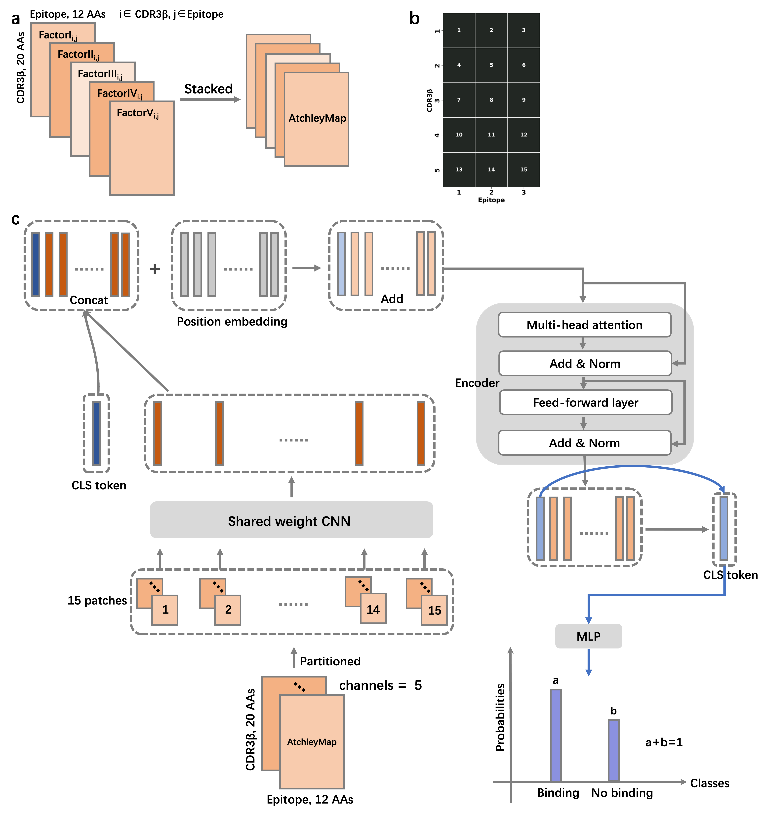
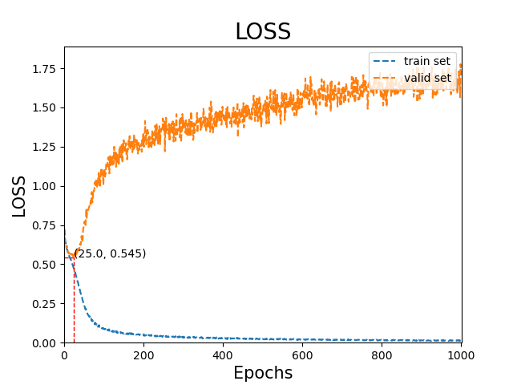

# VitTCR
VitTCR: A deep learning method for peptide recognition prediction Jiang, M., Yu, Z., Lan, X. et al. 2023.


## Introduction 
VitTCR is a deep learning-based method specifically designed to predict the interactions between epitopes and the CDR3β region of TCRs.

* Original mode: original setting (path to code: ./vittcr/orig/code)
* Cluster-based filtering of datasets: clustered setting (path to code: ./vittcr/clustered/code)
* PBWM integration mode: pbwm setting (path to code: ./vittcr/pbwm/code)


## Requirements
* python(version=3.8.8) ; 
* pytorch (version=1.9.0) ;
* pytorch-gpu (version=1.9.0) ; 
* pandas (version=1.2.4) ; 
* numpy (version=1.19.5) ; 
* scikit-learn (version=0.24.1) ; 
* scipy (version=1.6.3)
* matplotlib (version=3.3.4) ; 
* seaborn (version=0.11.2) ; 


## Create a required virtual environment
#### Command
```
conda env create -f environment.yaml
```

## Model training
#### Command
```
python ./orig/code/1.train.py \
    --batchsize 512 --epochs 1000 --learningrate 0.001 \
    --repeat 5 --fold 5 \
    --inpath /path/to/dataset \
    --modelname ModelName


Usage: 1.train.py [options]
Required:
        --learningrate INT: specify the batch size for minibatch
        --repeat INT: specify the number of repetitions for cross-validation
        --fold INT: specify the number of folds for cross-validation
        --modelname STRING: specify the name of model for training
        --inpath STRING: specify the path to training set
```

#### The structure of inpath (training set)

    dataset
    ├── fold0
    │   ├── atchleypickle
    │   │   ├── test.pickle
    │   │   └── train.pickle
    │   ├── test.tsv
    │   └── train.tsv
    ├── fold1
    │   
    ├── fold2
    │   
    ├── fold3
    │   
    └── fold4
        


#### The structure of outpath
    outputs/
    ├── metrics_repeat0
    │   ├── Train_modelvitTCR_lr0.001_fold0.tsv
    │   ├── Train_modelvitTCR_lr0.001_fold1.tsv
    │   ├── Train_modelvitTCR_lr0.001_fold2.tsv
    │   ├── Train_modelvitTCR_lr0.001_fold3.tsv
    │   └── Train_modelvitTCR_lr0.001_fold4.tsv
    ├── metrics_repeat1
    │   
    ├── metrics_repeat2
    │  
    ├── metrics_repeat3
    │  
    └── metrics_repeat4
       

#### Snippet of train.tsv/test.tsv
| cdr3b | peptide | Binding |
| ------- | ------- | ------- |
| CASSPTGLGETQYF | CLNEYHLFL | 1 |
| CASSFNRAMNTEAFF | YVLDHLIVV | 0 |
* cdr3b: amino acid sequence of CDR3bs
* peptide: amino acid sequence of epitopes
* Binding: binding (1) or no-binding (0)


#### Generation of train.pickle/test.pickle
* Prior to predicting a pair of CDR3β and antigenic epitopes, it is necessary to convert their sequence information into numerical representations. The Atchley factors consist of five factors that represent different physicochemical characteristics, with each amino acid being characterized by these five factors.
```
python ./vittcr/atchleymap.py \
    --inpath /path/to/input_tsv_file \
    --outpath /path/to/output_pickle_file


Usage: python atchleymap.py [options]
Required:
        --inpath STRING: specify the path of input files (*.tsv)
        --outpath STRING: specify the path of output files (*.pickle)
```

## Model selection
* The hyperparameters of the model were determined through cross-validation.
#### Command
```
python ./orig/code/3.cv.py \
    --repeat 5 --fold 5 \
    --outpath /path/to/cv_performance_files


Usage: python 3.cv.py [options]
Required:
        --repeat INT: specify the number of repetitions for cross-validation
        --fold INT: specify the number of folds for cross-validation
        --outpath STRING: specify the path to the performance files of cross validation
```



* As shown in the above figure, the model trained up to the 25th epoch will be selected.


## Model evaluation
#### Command
```
python ./orig/code/4.test_total.py \
    --repeat 5 --fold 5 \
    --testinput /path/to/independent_testset.pickle \

Usage: python 4.test_total.py [options]
Required:
        --repeat INT: specify the number of repetitions for cross-validation
        --fold INT: specify the number of folds for cross-validation
        --testinput STRING: specify the path to the independent test set (in the format of pickle)
```

## Model prediction
#### Command
```
python ./orig/code/predict.py \
    --repeat 5 --fold 5 \
    --input input.tsv --output 

Usage: python predict.py [options]
Required:
        --repeat INT: specify the number of repetitions for cross-validation
        --fold INT: specify the number of folds for cross-validation
        --input STRING: specify the path to the dataset
        --output STRING: specify the path to the output results
```

#### Snippet of input (input.tsv)
| cdr3b | peptide | 
| ------- | ------- | 
| CASSPTGLGETQYF | CLNEYHLFL |
| CASSFNRAMNTEAFF | YVLDHLIVV |
* cdr3b: amino acid sequence of CDR3bs
* peptide: amino acid sequence of epitopes


Related datasets and trained model parameters are deposited in Google Cloud Drive: 
https://drive.google.com/drive/folders/1PAS23boq9v5pjeaFu08FKLqjvT5P2ABe?usp=sharing
